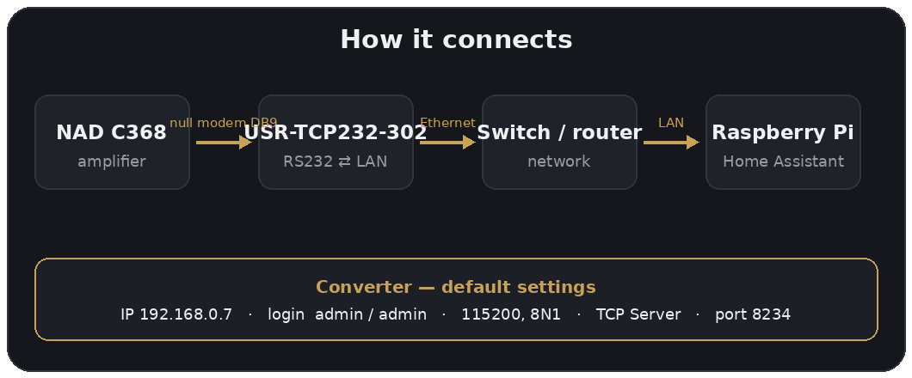
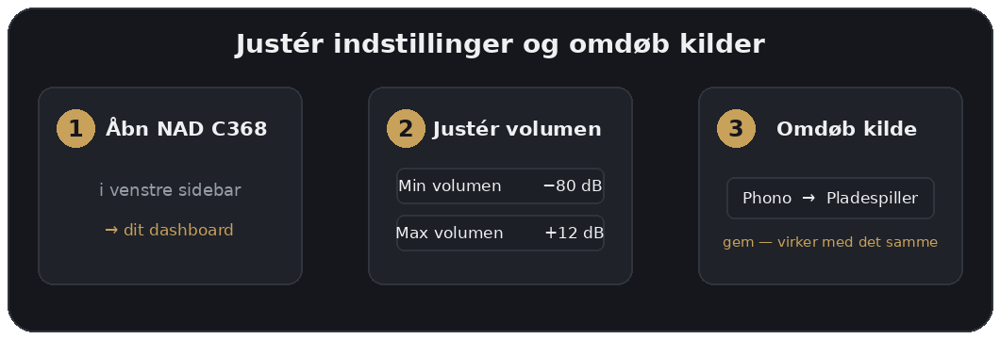

  

<h1 align="center">NAD C368 HA + HOMEKIT CONTROL</h1>

  Control your <b>NAD C368</b> amplifier from Home Assistant — and from Apple HomeKit/Siri —
  through a USR-TCP232-302 serial-to-Ethernet converter. 
  An original integration by <b>MrStaLu</b>.

---

## ✨ Features (v1.3.2)

| Entity | Type | What |
|---|---|---|
| NAD C368 | `media_player` | Power, volume, mute, source selection (8 inputs) |
| Bass / Treble | `number` | −7 to +7 dB |
| Balance | `number` | −18 to +18 |
| Speaker A / B | `switch` | On/Off |
| Tone Defeat | `switch` | Bypasses bass/treble EQ |
| Min/Max volume, step, poll | `number` | Settings — editable straight from the dashboard |
| Input 1–8 name | `text` | Rename inputs from the dashboard |

Plus: **volume shown as 0–100 %** (linear dB mapping), **universal actions** for any RS232 command, and **English + Danish** UI (Home Assistant picks the language automatically).

---

## 🛒 Hardware — and where to buy it

You'll need:

- A **NAD C368** amplifier (RS232 port on the back, DB9 female)
- A **USR-TCP232-302** serial-to-Ethernet converter — available from
  **[CDON](https://cdon.dk/hjemme-elektronik/usr-tcp232-302-rs232-till-tcp-ip-omvandlare-serial-till-ethernet-support-dns-dhcp-inbyggd-webbplats-c105000015476055)**
  (or [Fruugo](https://www.fruugo.dk/mini-seriel-portserver-seriel-til-ethernet-modulkonverter-usr-tcp232-302/p-400318900-851897763?language=da),
  [eBay](https://www.ebay.com/itm/334411000168) or [Amazon](https://www.amazon.de/dp/B01GPGPEBM))
- A **DB9 male-to-male null modem cable** (pins 2 and 3 crossed)
- An **Ethernet cable**
- A **Raspberry Pi** running Home Assistant (or any other HA install)

---

## 🔌 Step 1 — The converter (USR-TCP232-302)

The converter ships with IP **192.168.0.7** and login **admin / admin**. Put your computer
temporarily on the same subnet (e.g. 192.168.0.10), open `http://192.168.0.7` in a browser, log in and set:

| Setting | Value |
|---|---|
| Baud rate | 115200 |
| Data bits | 8 |
| Parity | None |
| Stop bits | 1 |
| Flow control | None |
| Work mode | **TCP Server** |
| Local port | 8234 |
| Device IP | a static IP on your network, e.g. 192.168.1.200 |

Add a DHCP reservation on your router so the IP doesn't change. Wire it up:
**NAD C368 → null modem DB9 → converter → Ethernet → network**.

---

## 📦 Step 2 — Install in Home Assistant (HACS)

1. Open **HACS → Integrations → ⋮ (top right) → Custom repositories**
2. Add `https://github.com/MrStaLu/NAD-C368-homeassistant` as type **Integration** → **Add**
3. Search for **NAD C368** in the list → **Download**
4. **Restart Home Assistant**

Manual installation (without HACS)

1. Copy the `custom_components/nad_c368` folder into your HA `config/custom_components/`
2. Restart Home Assistant

---

## ⚙️ Step 3 — Add the device

1. **Settings → Devices & Services → Add Integration**
2. Search for **NAD C368**
3. Enter the converter's **IP address** and **port** (e.g. 192.168.1.200 / 8234) → **Submit**

The entities are created automatically. Add them to a dashboard (or create a "NAD C368" dashboard)
to get a fixed item in the sidebar.

---

## 🎚️ Step 4 — Adjust settings and rename inputs

All settings are **entities**, so you change them straight from the dashboard or the device page —
no restart needed.

- **Volume mapping:** set `Minimum volume` (= 0 %) and `Maximum volume` (= 100 %) in dB.
  Default is −80 → +12 dB. 10 % ≈ −71 dB.
- **Rename an input:** change e.g. the `Input 5 name` text field from *Phono* to *Turntable* — the
  name is used immediately in the source selector.
- You can also use **Settings → Devices & Services → NAD C368 → Configure** for the same.

### Sources (default mapping)

| No. | Input | | No. | Input |
|---|---|---|---|---|
| 1 | Optical 1 | | 5 | Phono |
| 2 | Optical 2 | | 6 | Line 1 |
| 3 | Coaxial 1 | | 7 | Line 2 |
| 4 | Coaxial 2 | | 8 | Bluetooth |

---

## 🍎 Apple HomeKit / Siri

Add the **HomeKit Bridge** (Settings → Devices & Services → Add Integration → HomeKit Bridge)
and select `media_player.nad_c368`. You can then control power, volume, mute and source from
Apple Home and Siri. Bass/treble/balance live only in the HA app (HomeKit has no equivalent).

---

## 🛠️ Every command (advanced)

Two actions make **any** RS232 command available from HA (Developer Tools → Actions):

- **`nad_c368.send_command`** — `command` + `value`, e.g. `Source5.Enabled` = `No`
- **`nad_c368.query`** — read any value back

---

<i>NAD C368 HA + HOMEKIT CONTROL — by MrStaLu</i>

